# 🎯 Angular Design Patterns

Uma aplicação educativa que demonstra a implementação de 5 Design Patterns essenciais no Angular, com exemplos interativos e código funcional.

## 🚀 Sobre o Projeto

Este projeto foi desenvolvido para analisar e demonstrar como os Design Patterns podem ser implementados de forma prática no Angular, mostrando suas aplicações reais no desenvolvimento frontend.

## 📋 Design Patterns Implementados

### 1. 🏭 **Factory Pattern**
- **Conceito:** Criação de objetos sem especificar suas classes concretas
- **Implementação:** Sistema de criação de veículos (Carro, Moto, Caminhão)
- **Angular:** ComponentFactoryResolver, ViewContainerRef, Service Factories

### 2. 👁️ **Observer Pattern**
- **Conceito:** Notificação automática de mudanças de estado
- **Implementação:** Sistema de notícias com observadores
- **Angular:** RxJS Observables, EventEmitter, Change Detection

### 3. 🔒 **Singleton Pattern**
- **Conceito:** Garantir uma única instância de uma classe
- **Implementação:** Sistema de logging centralizado
- **Angular:** `providedIn: 'root'`, Dependency Injection

### 4. 🎯 **Strategy Pattern**
- **Conceito:** Algoritmos intercambiáveis em tempo de execução
- **Implementação:** Sistema de pagamentos (PIX, Cartão, Transferência)
- **Angular:** Form Validators, HTTP Interceptors, Route Guards

### 5. 🎨 **Decorator Pattern**
- **Conceito:** Adicionar comportamentos dinamicamente
- **Implementação:** Sistema de personalização de café
- **Angular:** @Component, @Injectable, HTTP Interceptors, Directives

## 🎨 Diagrama dos Design Patterns

```mermaid
graph TB
    subgraph "🏭 Factory Pattern"
        F1[VehicleFactory] --> F2[Car]
        F1 --> F3[Motorcycle]
        F1 --> F4[Truck]
        F2 --> F5[Vehicle Interface]
        F3 --> F5
        F4 --> F5
    end

    subgraph "👁️ Observer Pattern"
        O1[NewsSubject] --> O2[NewsObserver 1]
        O1 --> O3[NewsObserver 2]
        O1 --> O4[NewsObserver 3]
        O1 -.->|notify| O2
        O1 -.->|notify| O3
        O1 -.->|notify| O4
    end

    subgraph "🔒 Singleton Pattern"
        S1[LoggerService] --> S2[Instance 1]
        S1 --> S3[Instance 2]
        S1 --> S4[Instance 3]
        S2 -.->|same instance| S3
        S3 -.->|same instance| S4
    end

    subgraph "🎯 Strategy Pattern"
        ST1[PaymentContext] --> ST2[CreditCardStrategy]
        ST1 --> ST3[PixStrategy]
        ST1 --> ST4[BankTransferStrategy]
        ST2 --> ST5[PaymentStrategy Interface]
        ST3 --> ST5
        ST4 --> ST5
    end

    subgraph "🎨 Decorator Pattern"
        D1[Espresso] --> D2[MilkDecorator]
        D2 --> D3[SugarDecorator]
        D3 --> D4[VanillaDecorator]
        D1 --> D5[Coffee Interface]
        D2 --> D5
        D3 --> D5
        D4 --> D5
    end

    classDef factory fill:#e1f5fe
    classDef observer fill:#f3e5f5
    classDef singleton fill:#e8f5e8
    classDef strategy fill:#fff3e0
    classDef decorator fill:#fce4ec

    class F1,F2,F3,F4,F5 factory
    class O1,O2,O3,O4 observer
    class S1,S2,S3,S4 singleton
    class ST1,ST2,ST3,ST4,ST5 strategy
    class D1,D2,D3,D4,D5 decorator
```



### 🔍 **Explicação dos Diagramas:**

- **🏭 Factory:** Centraliza criação de objetos através de uma interface comum
- **👁️ Observer:** Subject notifica múltiplos observers sobre mudanças
- **🔒 Singleton:** Garante que todas as instâncias sejam a mesma
- **🎯 Strategy:** Contexto escolhe algoritmo em tempo de execução
- **🎨 Decorator:** Envolve objetos adicionando funcionalidades dinamicamente

## 🛠️ Tecnologias Utilizadas

- **Angular 17+** - Framework principal
- **TypeScript** - Linguagem de programação
- **RxJS** - Programação reativa
- **CSS3** - Estilização moderna
- **HTML5** - Estrutura semântica

## 🎨 Características

- ✅ **Exemplos Interativos** - Cada padrão possui uma demonstração funcional
- ✅ **Código Real** - Implementações completas e funcionais
- ✅ **Interface Moderna** - Design responsivo e intuitivo
- ✅ **Explicações Detalhadas** - Conceitos, fluxos e implementações
- ✅ **Estrutura Organizada** - Código limpo e bem documentado

## 🚀 Como Executar

```bash
# Instalar dependências
npm install

# Executar em modo desenvolvimento
ng serve

# Compilar para produção
ng build
```

## 📁 Estrutura do Projeto

```
src/app/
├── core/
│   └── components/          # Componentes principais
├── features/
│   ├── factory/            # Factory Pattern
│   ├── observer/           # Observer Pattern
│   ├── singleton/          # Singleton Pattern
│   ├── strategy/           # Strategy Pattern
│   └── decorator/          # Decorator Pattern
└── shared/
    └── styles/             # Estilos compartilhados
```

## 🎯 Objetivos

- **Educativo:** Demonstrar padrões de forma prática
- **Prático:** Mostrar implementações reais no Angular
- **Interativo:** Permitir experimentação com os padrões
- **Moderno:** Usar as melhores práticas do Angular

## 📚 Aprendizado

Este projeto é ideal para:
- Desenvolvedores Angular que querem entender Design Patterns
- Estudantes de programação
- Profissionais que buscam melhorar a arquitetura de código
- Qualquer pessoa interessada em padrões de design
